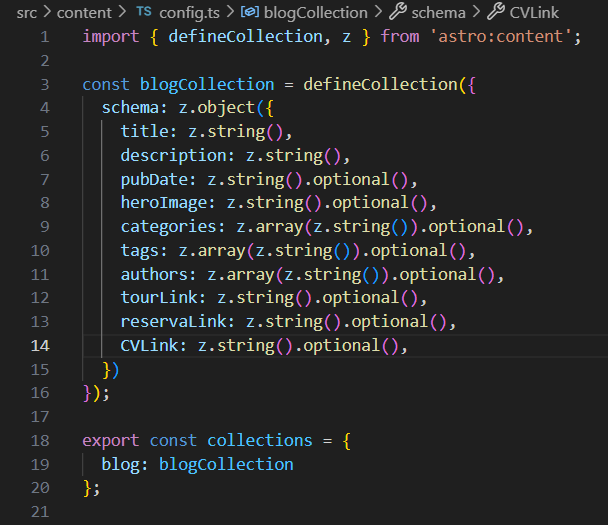

<h1>Manual de usuario para la página web de CEINTECCI</h1>

En esta página usted encontrará información, links relevantes y formularios del centro de investigación CEINTECCI de la universidad ECCI para facilitar el acceso a nuestros proyectos, investigaciones, productos y convocatorias.

Desarrollada con Astro y Tailwind.

Para más información puede consultar en la documentación de astro: 

```scheme
[(https://docs.astro.build/en/getting-started/)]
```
Tailwind
```scheme
[https://v2.tailwindcss.com/docs]
```
Astro Theme:
```scheme
[https://github.com/gndx/ev0-astro-theme]
```

Link de la página: https://ceintecci.github.io/

links de los formularios:

- βLab: https://forms.gle/snUwdTGedjBbZjZT7
- Laboratorio de simulación y ciencia de datos: https://forms.gle/AoBvjysndeZ3NdYa7
- Laboratorio IT: https://forms.gle/1PrpEudnjKDL28w29
- Laboratorio realidad virtual y aumentada: https://forms.gle/9wuFJfFtsuBRBwyZ6
- Laboratorio de biomecánica: https://forms.gle/gi4xGQcnQ32ukpmk6
- Meetlab / Coworking: https://forms.gle/Gj4fT4ArgVZPMsXx7
- Laboratorio Hipertermia magnética: https://forms.gle/JnEbQkWcxHfbPAhH7
- Laboratorio ciencias biológicas (BSL3): https://forms.gle/KUp5B1Du1W8Dvrmv7
- Link de la página usada para generar los códigos QR: https://es.qr-code-generator.com/

La página Web tipo blog consiste en recopilar información acerca de los proyectos realizados por el centro de investigación e innovación de la universidad ECCI (CEINTECCI), además, encontrará los links para acceder a las convocatorias internas de nuestro centro. 

<h2>Estructura:</h2>  

- Página principal donde encontrará en el Header apartados como infromación del centro, logos, sección de About Us, categorías y redes sociales del centro.
- Categorias
  - Laboratorios: Aquí encontrarán todos los laboratorios vinculados a CEINTECCI, sus links de Reservas y Tours e información general. 
  - Convocatorias: En la categoría Convocatorias encontrará las convocatorias actuales del centro de investigación para Jovenes investigadores y profesores que deseen postular su proyecto para recibir ayuda de un joven investigador. 
  - OpenLabs: Eventos realizados por Jovenes investigadores para acercar a estudiantes al centro de investigación. 
  - Investigaciones: (Falta información)
  - Productos: (Falta infromación)
  - Sprint Days: (Falta información)
- Footer donde encontraremos los logos de la unviersidad ecci y sus certificacioes de investigación


## Estructura del proyecto:

```
/
├── public/
│   └── favicons/
│   └── fonts/
│   └── blog-placeholder.jpg
│   └── favicon.png
│   └── humans.txt
├── scripts/
│   └── youtube.cjs
├── src/
│   ├── components/
│   ├── config/
│   ├── content/
│   ├── layouts/
│   └── pages/
│   └── styles/
│   └── env.d.ts
└── package.json
└── astro.config.mjs
└── tailwind.config.js
└── tsconfig.json
└── .gitignore
```

## ¿Cómo inicializar el proyecto?

Clona este repositorio con el siguiente comando en bash o instala el .zip

```scheme
[git clone https://github.com/CEINTECCI/CEINTECCI.github.io.git]
```

| Comando           | Acción                                       |
| :---------------- | :------------------------------------------- |
| `npm install`     | Instala las dependencias                     |
| `npm run dev`     | Inicia el servidor, ejem: 'localhost:4321'   |
| `npm run build`   | Construye tu página web en  `./dist/`        |
| `npm run preview` | Revisa tu proyecto en local host             |
| `npm run newpost` | Genera un nuevo componente markdown(blog)    |


<h2>Configuración de Markdown</h2>
Lo principal es conocer los apartados para agregar secciones tipo blog en markdown de infromación como se puede ver en la categoría laboratorio:


Estos Markdown serán el contenido muestreado en la página web, se pueden encontrar, modificar y agregar desde la carpeta:
- Src -> Content - > Blog
En esta carpeta se encuentran archivos .md (Markdown); Para seguir la estrucutra de la página web debe seguir el siguiente formato: 


Estos Markdown tienen que seguir la misma estructura, debemos asegurarnos de contener todos los apartados de Titulo, descripción, categorias, etc.

<h2>Imagenes</h2>
Para agregar imágenes en las categorías o blog, tendremos que agregarlas desde la carpeta principal <h4>Public</h4> Solo tendrás que subir una imagen a la carpeta y para usarla solo hará falta el link directo, como por ejemplo: '/JovenInvestigador.webp'

<h2>Modificar estilos de la página web</h2>

Estos se pueden modificar en el archivo principal **tailwind.config.cjs** para agregar nuevos estilos, cambiarlos, modificarlos, etc.


<h2>Modificar estilos de blogs</h2>

En este archivo que se encuentra en la dirección src/pages/categories/[category].astro donde se puede modificar la estructura visual, botones, etc.

Los botones de los formularios se pueden agregar a otra categoría si se necesita en este apartado, para poder ser leido por los markdowns necesitamos agregarlo en la ruta **src/content/config.ts** de la siguiente forma: 

